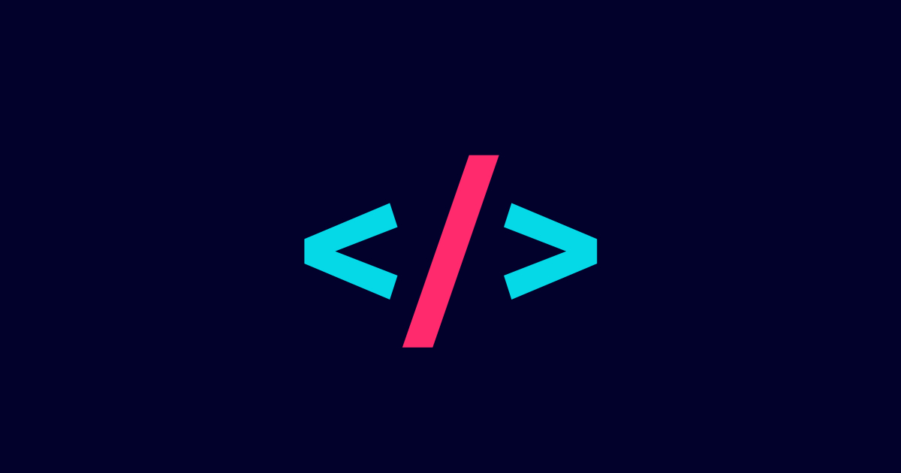

## Raul Maulidhino Personal Portfolio
A personal portfolio website, built with HTML, CSS, Tailwind, JavaScript and React.

## Project Status
This personal project is currently in development. Visitors can see and read the information about me on the website. More functional and interactive features will be added gradually until I graduated from high school and go to college.

## Installation and Setup Instructions
To see the project, follow these steps:

1. **Clone the Repository**

   Clone the repository to your local machine and navigate into the project directory:

   ```bash
   git clone https://github.com/raulmaulidhino-dev/raulmaulidhino-portfolio.git
   cd raulmaulidhino-portfolio
   ```

2. **Install Dependencies**

   Ensure you have [Node.js](https://nodejs.org/en) installed. Then, install the project dependencies by running:
   
   ```bash
   npm install
   ```

4. **Run the Development Server**

   Start the development server to see the project in action:
   
   ```bash
   npm run dev -- --open
   ```

   If it doesn't open automatically, you could open your browser and go to [`http://localhost:5173`](http://localhost:5173) to view the application.

- Alternatively, you also could see the portfolio website here : [raulmaulidhino.pages.dev](https://raulmaulidhino.pages.dev)

## Reflection
This was a 1-week personal portfolio website project during the Multimedia Workshop "Develop Your Own Portfolio Website" by [MAGE X ITS](https://mage-its.id/) and [JagoTeknik](https://jagoteknik.id/). The goals of creating my own portfolio website are to enhance personal brand, learn new frameworks and/or libraries for web development, and improve my skills in web development, especially front-end development.

One of the main challenges that I struggled with was the Styling with Tailwind and Layouting with React + Vite. It was the first time I used Tailwind, React and Vite in my website project. Thus, I try as I can to learn by doing.

Originally, the technologies I used in this portfolio project should be HTML, CSS, Tailwind, JavaScript, React and `react-router-4.0`. Due to project time constraints, I had to prioritize the layout and responsivity of the web, and didn't have time to add `react-router-4.0` in this project. I plan to implement that tool in the future.
